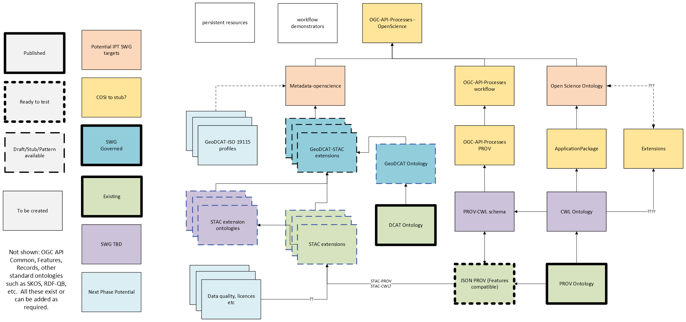

# Open Science Building Blocks 

The repository documents a set of [OGC Building Blocks](https:blocks.ogc.org). for Open Science, which in turn leverage reusable ontologies, schemas, APIs etc. from published OGC standards.

The set of building blocks and the interoperability specifications composed from them are visble here https://ogcincubator.github.io/bblocks-openscience/

An overview of the architecture and status :

 
